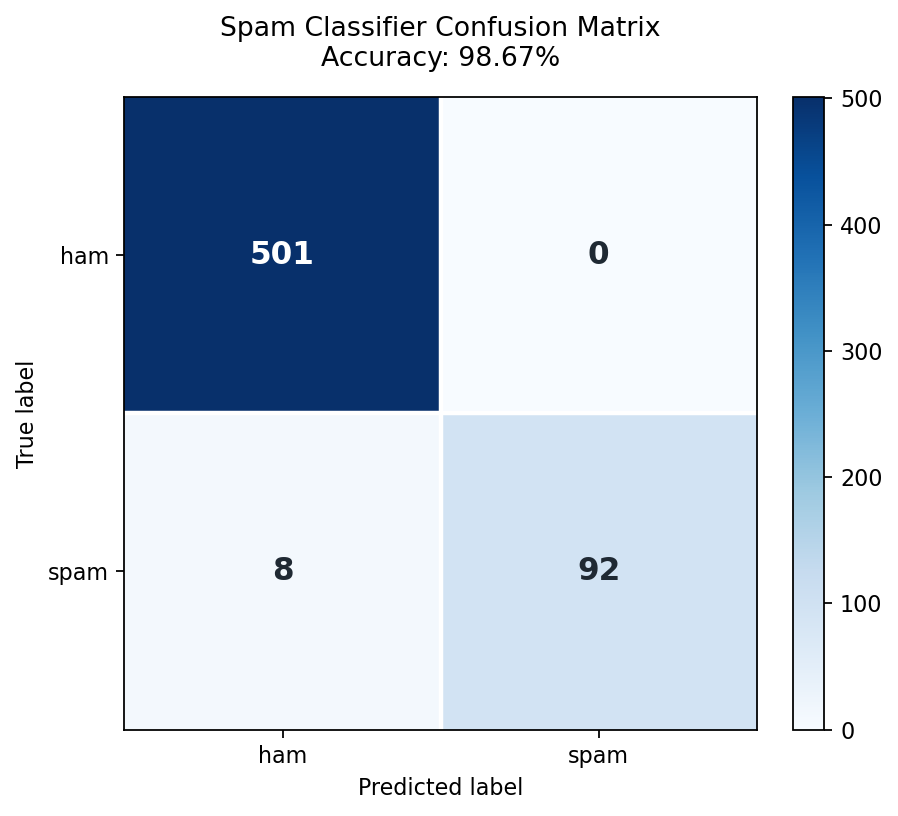

# 测试报告

## 1. 测试环境

本次项目在 WSL2/Linux 环境中测试：

- 操作系统：Linux `6.6.87.2-microsoft-standard-WSL2`
- 架构：x86_64
- CPU：Intel Core Ultra 9 275HX，24 逻辑 CPU
- 内存：31 GiB
- Python 环境：Conda `agent_2`
- Python：3.10.19
- 主要依赖：
  - `aiosmtpd 1.4.6`
  - `scikit-learn 1.7.2`
  - `joblib 1.5.3`
  - `pyyaml 6.0.3`
  - `pytest 9.0.3`
  - `matplotlib 3.10.8`

依赖声明见 `requirements.txt`，pytest 配置见 `pytest.ini`。

## 2. 自动化测试

执行命令：

```bash
python -m compileall -q mailapp tests scripts run_server.py run_client.py run_gui.py run_demo.py
python -m pytest -q
```

当前自动化结果：

```text
25 passed
```

覆盖范围：

- 端到端流程：Alice 发送邮件给 Bob、Bob inbox 查询、spam 移动、邮件撤回后 inbox 不再显示。
- GUI 辅助逻辑：收件人解析、重复去重、认证/撤回错误转换为友好提示、spam 显示 `[SPAM]` 和行高亮。
- MIME：文本邮件、HTML fallback、附件构造解析、headers 和正文提取。
- 协议层：POP3 状态机、STLS、dot-stuffing、SMTP STARTTLS + AUTH、10 并发发送。
- 邮件撤回：发件人可撤回、非发件人拒绝、错误密码拒绝、状态变更。
- 用户注册：邮箱格式、密码长度、重复账号、注册后登录。
- 垃圾邮件：关键词 fallback、训练模型、metrics、confusion matrix、模型预测。
- 存储层：mail_id 生成、inbox 查询、主题保存、文件系统与数据库一致性。

测试文件：

- `tests/test_end_to_end.py`
- `tests/test_gui_helpers.py`
- `tests/test_mime.py`
- `tests/test_protocols.py`
- `tests/test_recall.py`
- `tests/test_registration.py`
- `tests/test_spam.py`
- `tests/test_storage.py`

## 3. 垃圾邮件模型测试

数据集：Apache SpamAssassin Public Corpus，easy_ham + spam，共 3002 封。

模型：TF-IDF + Linear SVM。

量化结果：

- 训练样本：2401
- 测试样本：601
- Accuracy：98.67%
- Ham precision：98.43%
- Ham recall：100.00%
- Spam precision：100.00%
- Spam recall：92.00%
- Spam F1：95.83%

混淆矩阵：

```text
          Pred ham   Pred spam
True ham     501        0
True spam      8       92
```



完整指标来源：

- `data/models/spam_metrics.json`
- `docs/spam_confusion_matrix.png`
- `scripts/plot_spam_confusion_matrix.py`

## 4. 并发压力测试

手动压力测试命令：

```bash
python run_server.py
python scripts/concurrency_test.py --clients 50
```

50 客户端实测结果：

- 期望发送：50
- 成功发送：50/50
- 失败发送：0
- SQLite 邮件记录：50/50
- SQLite 收件人记录：50/50
- 总耗时：2.669 秒
- 吞吐量：18.74 emails/s

脚本会输出：

- 成功数
- 失败数
- 数据库记录数
- 总耗时
- 吞吐量
- 平均/最小/最大发送延迟

来源文件：`scripts/concurrency_test.py`。

## 5. TLS 防护测试

默认配置：

- SMTP：STARTTLS
- POP3：STLS
- `ssl_verify: true`
- CA：`certs/mailapp-cert.pem`

测试方式：

1. 生成攻击者证书 `certs/attacker-cert.pem`。
2. 将 `config.yaml` 中 `ssl_cafile` 临时改成攻击者证书。
3. 重新启动 `python run_demo.py`。
4. GUI 中发送邮件。

预期结果：

- 客户端拒绝 TLS 握手。
- GUI 显示 certificate verify failed / TLS handshake failed。
- 恢复正确 CA 后，邮件发送恢复成功。

该测试证明客户端会校验证书链，伪造证书不能通过加密连接。

## 6. GUI 演示测试

演示流程：

1. Alice 发送两封带附件邮件。
2. Bob 通过 POP3 STLS 接收邮件。
3. Bob 打开邮件，GUI 展示 From、To、Subject、Body。
4. 终端检查 `.eml` 和附件保存到 `data/client_downloads/bob_at_example.com/`。
5. Alice 发送垃圾邮件模板。
6. Bob 接收后，Spam 页签显示 `[SPAM]` 前缀和红色高亮。
7. TLS & Model 页签展示 STARTTLS/STLS、证书校验和模型状态。

## 7. 剩余限制

- GUI 自动化没有使用端到端 UI 测试框架，只测试 helper 函数和业务流程。
- 中间人攻击为伪造 CA/证书校验失败演示，不包含真实网络代理转发。
- 公开语料模型结果依赖已下载数据集和固定训练流程。
- 真实互联网邮件系统的撤回无法由 SMTP/POP3 强制实现，本项目撤回仅适用于模拟服务器内部邮箱。
